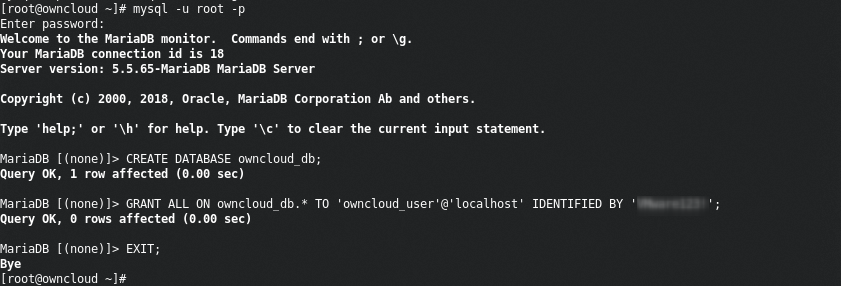
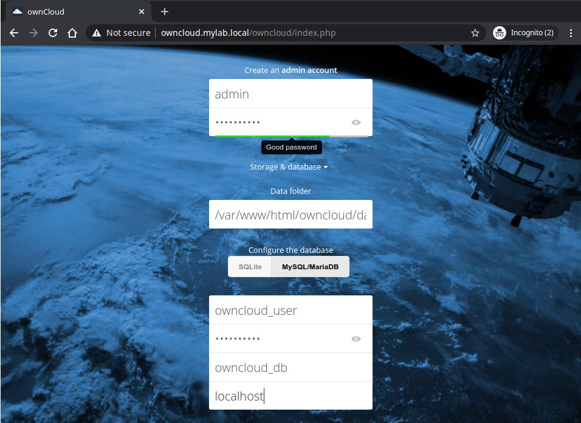

<!-- As an administrator, how do I install and configure an Owncloud server? -->
# Install and Configure ownCloud Server
{: .no_toc }
ownCloud offers a variety of installation options:
- [Tarball](https://owncloud.org/download/#owncloud-server-tar-ball)
- [Docker](https://doc.owncloud.org/server/10.4/admin_manual/installation/docker/)
- [Appliance](https://owncloud.org/download/#owncloud-server-appliance)
- [Linux packages](https://owncloud.org/download/#owncloud-server-linux-packages)

In this document we will cover a standard single-server installation on [CentOS 7](https://www.centos.org/).  

## Table of contents
{: .no_toc .text-delta }
- TOC
{:toc}

## Prerequisites
- A fresh installation of [CentOS 7](https://www.centos.org/) with SSH enabled.
- This guide assumes that you are connected as the `root` user.

## Prepare the Server
According to [ownCloud documentation](https://doc.owncloud.com/server/admin_manual/installation/system_requirements.html) the supported environments for *best performance*, *stability*, *support*, and *full functionality* are:  

| Platform                  | Options                                                                                                                                                                     |
|---------------------------|-----------------------------------------------------------------------------------------------------------------------------------------------------------------------------|
| Operating Systems (64bit) | - Debian 9 and 10<br>- Fedora 30 and 31<br>- Red Hat Enterprise Linux/Centos 7.5 and 8<br>- SUSE Linux Enterprise Server 12 with SP4 and 15<br>- Ubuntu 16.04 and 18.04<br>- openSUSE Leap 42.3 and 15 |
| Database                  | - MySQL 8+ or MariaDB 10+ (**Recommended**)<br>- Oracle 11 and 12<br>- PostgreSQL 9 and 10<br>- SQLite (**Not for production**)                                                                    |
| Web server                | Apache 2.4 with `prefork` and `mod_php`                                                                                                                                   |
| PHP Runtime               | 7.1, 7.2, and 7.3                                                                                                                                                           |


First, make sure the server is up to date:
```sh
yum update -y && yum upgrade
```
The current installed version should be `CentOS Linux release 7.8.2003 (Core)`.  
You can check the version by issuing:
```sh
cat /etc/centos-release
```

### Install and configure the LAMP stack
In this section, we'll be installing the **LAMP** (Linux, Apache, MySQL, PHP) stack as a prerequisite for ownCloud to function properly.

#### Enable additional repositories
Enter the following commands in order to install and enable the **EPEL** (Extra packages for Enterprise Linux) and **Remi** repositories:
```sh
yum install -y https://dl.fedoraproject.org/pub/epel/epel-release-latest-7.noarch.rpm
yum install -y http://rpms.remirepo.net/enterprise/remi-release-7.rpm
```
**CentOS 7** ships by default with **PHP 5** thus, the **Remi** repository is needed to retrieve and install **PHP 7**.  
Next, using `yum-config-manger`, disable `remi-php54` and enable `remi-php73`.  
`yum-config-manger` is provided by the package `yum-utils`.
```sh
yum install -y yum-utils
yum-config-manager --disable remi-php54
yum-config-manager --enable remi-php73
```

#### Install Apache Web Server, MySQL(MariaDB) and php
Install the following packages:
```sh
yum install -y httpd php php-mysqlnd php-intl php-dom php-mbstring php-gd php-pdo php-json php-xml php-zip php-gd php-curl php-pecl-mcrypt php-pear unzip mariadb-server mariadb
```

#### Enable and start httpd service:
```sh
systemctl enable httpd.service
systemctl start httpd.service
```

### Configure the Database
In this section, we enable and start the **MariaDB** service and create a new database and relative user for onwCloud.

#### Enable and start mariadb service:
```sh
systemctl enable mariadb.service
systemctl start mariadb.service
```
Next, configure the security settings for MariaDB issuing `mysql_secure_installation`. Make sure to chose a strong password:
```sh
Enter current password for root (enter for none):
Set root password? [Y/n] Y
Remove anonymous users? [Y/n] Y
Disallow root login remotely? [Y/n] Y
Remove test database and access to it? [Y/n] Y
Reload privilege tables now? [Y/n] Y
```

#### Create DB and user:
Login as `root` to MariaDB:
```sh
mysql -u root -p
```
Now it's time to create a database and relative user for ownCloud:
```sql
GRANT ALL ON owncloud_db.* TO 'owncloud_user'@'localhost' IDENTIFIED BY '<YourPassword>';
FLUSH PRIVILEGES;
EXIT;
```


## Install onwCloud
This section explains how to install **onwCloud Server** from the official repository for the **CentOS 7** distribution.  
This is the quickest and easiest method for setting up a single standalone onwCloud server.  
For large production distributed deployments, the recommended method would be to downloading and installing the tarball version.  
For more information, please refer to the official [ownCloud Documentation](https://doc.owncloud.org/server/10.4/admin_manual/installation/deployment_considerations.html).

### Add ownCloud repository
ownCloud packages repository is available at the following URL: <https://download.owncloud.org/download/repositories/production/owncloud/>

Use the below commands in order to enable the repository and install the `owncloud-files` package.
```sh
rpm --import https://download.owncloud.org/download/repositories/stable/CentOS_7/repodata/repomd.xml.key
curl -L https://download.owncloud.org/download/repositories/stable/CentOS_7/ce:stable.repo -o /etc/yum.repos.d/ownCloud.repo
```

### Install using yum
```sh
yum clean expire-cache
yum install -y owncloud-files
```

### Configure permissions
Configure permissions for the `apache` user: `chown -R apache:apache /var/www/html/owncloud/`

## Configure Firewall and SELinux
Allow http and https traffic towards the server from outside using the `firewall-cmd` command:
```sh
firewall-cmd --permanent --zone=public --add-service=http
firewall-cmd --permanent --zone=public --add-service=https
firewall-cmd --reload
```

Configure **SELinux** as follows:

```sh
semanage fcontext -a -t httpd_sys_rw_content_t '/var/www/html/owncloud/data(/.*)?'
semanage fcontext -a -t httpd_sys_rw_content_t '/var/www/html/owncloud/config(/.*)?'
semanage fcontext -a -t httpd_sys_rw_content_t '/var/www/html/owncloud/apps(/.*)?'
semanage fcontext -a -t httpd_sys_rw_content_t '/var/www/html/owncloud/apps-external(/.*)?'
semanage fcontext -a -t httpd_sys_rw_content_t '/var/www/html/owncloud/.htaccess'
semanage fcontext -a -t httpd_sys_rw_content_t '/var/www/html/owncloud/.user.ini'

restorecon -Rv '/var/www/html/owncloud/'```
```

Should you get the error `-bash: semanage: command not found`, please install the `policycoreutils-python` package:
```sh
yum install -y policycoreutils-python
```

## The Installation Wizard
When the ownCloud prerequisites are fulfilled and all ownCloud files are installed, the last step to completing the installation is running the *Installation Wizard*. This involves just four steps:
1. Point your web browser to `http://onwcloud_ip/owncloud`
2. Enter your desired administrator’s username and password
3. Configure the database
4. Click **Finish Setup**



We should be now ready to proceed with the product configuration through the web interface at `http://onwcloud_ip/owncloud/`.

## Next steps
To configure the server to listen for http requests on `http://owncloud_ip:8080` insted of `http://owncloud_ip/ownCloud`, see [Configure a custom url and http port](02-custom-url-port.md).  
To add users to your ownCloud server, see [Adding users](03-adding-users.md)
