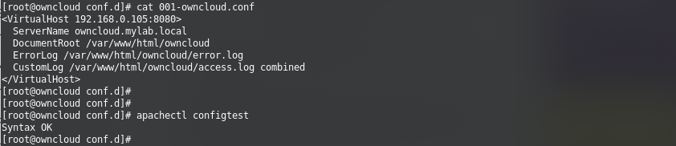
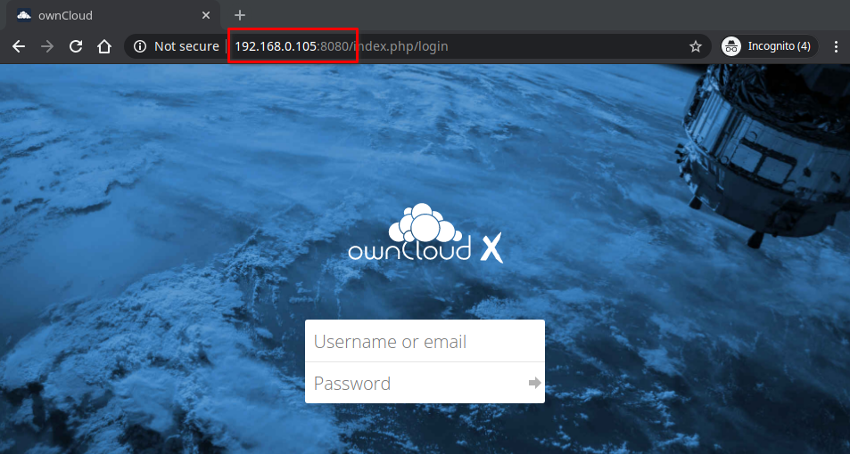

<!-- 2. As an administrator, how do I enable users to connect to the ownCloud server using the
server's IP address and port 8080? -->

# Configure a custom url and http port
{: .no_toc }
In this chapter we'll discuss how to configure Apache web server to redirect the homepage from `http://owncloud_ip/owncloud/` to `http://owncloud_ip:custom_port`.  
In this example we are going to be using the IP address `192.168.0.105` and tcp port `8080` (`http://192.168.0.105:8080`).  

## Table of contents
{: .no_toc .text-delta }
- TOC
{:toc}

## Configure httpd to listen on port 8080
Backup the current `/etc/httpd/conf/httpd.conf` and change `Listen 80` to `Listen 192.168.0.105:8080`.
```shi
cd /etc/httpd/conf/ && cp -p httpd.conf httpd.conf.bck && sed -i 's/^Listen 80$/Listen 192.168.0.105:8080/' httpd.conf
```
Save and close the file.

## Create a VirtualHost to redirect the homepage
Paste the following on your terminal as root in order to create the VirtualHost:

```sh
vhost="/etc/httpd/conf.d/owncloud.conf"
/bin/cat <<EOF >$vhost
<VirtualHost 192.168.0.105:8080>
  ServerName owncloud.mylab.local
  DocumentRoot /var/www/html/owncloud
  ErrorLog logs/owncloud_error_log
  CustomLog logs/owncloud_access_log combined
</VirtualHost>
EOF

```

You may want to check if the syntax of the configuration is correct with the following command:
```sh
apachectl configtest
```


Now restart Apache to make these changes take effect.

```sh
systemctl restart httpd
```

## Allow port 8080 through the Firewall
```sh
firewall-cmd --permanent --zone=public --add-port=8080/tcp
firewall-cmd --reload
```

Now you should be able to access your ownCloud server pointing your browser to `http://owncloud_ip:8080`


## Next steps
To add a new user to ownCloud, see "[Adding users](03-adding-users.md)".
