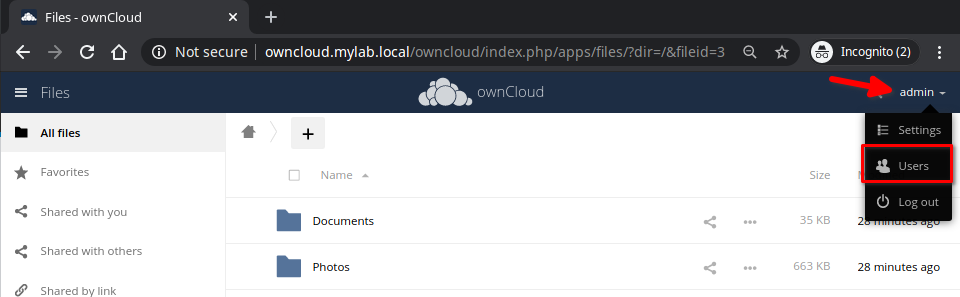
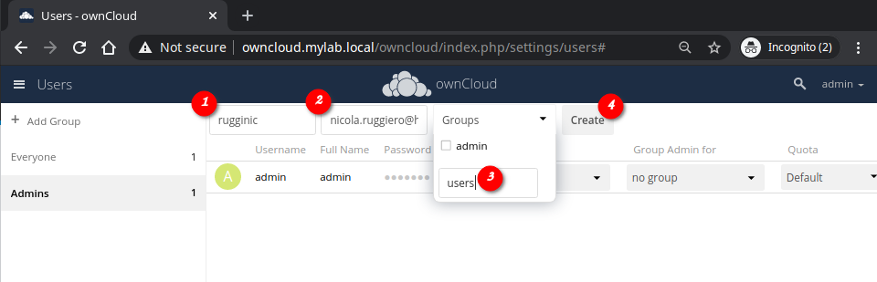
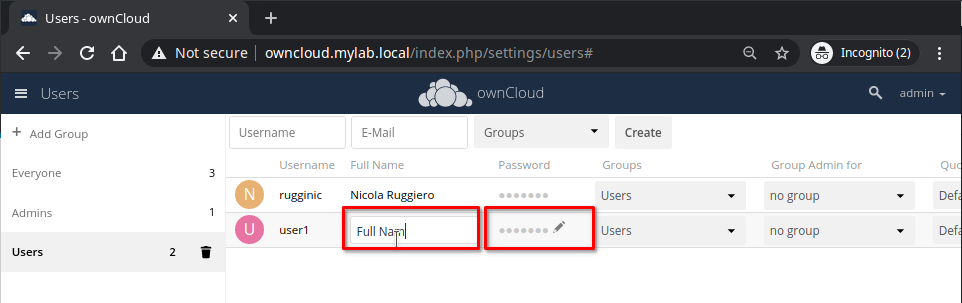

<!-- 3. As an administrator, how do I add a user account? -->
# Adding Users
1. Login to the web interface with your **Admin** credentials;
2. On the top right corner, select **admin** and chose **Users**

3. Add the user's details

4. Once created, from this pane you can set a temporary **password** for the user and change its full name or leave it for him/her to complete.

## Next steps
To learn how to connect to the ownCloud Server using a desktop or mobile client, see [Desktop and mobile client](04-desktop-mobile-connection.md)
