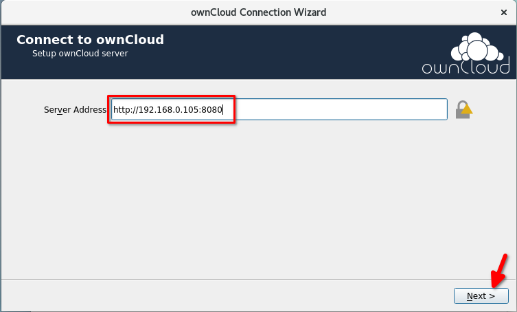
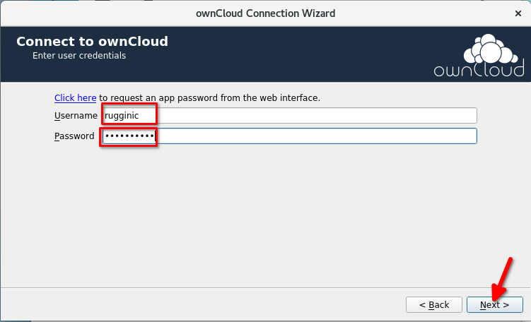
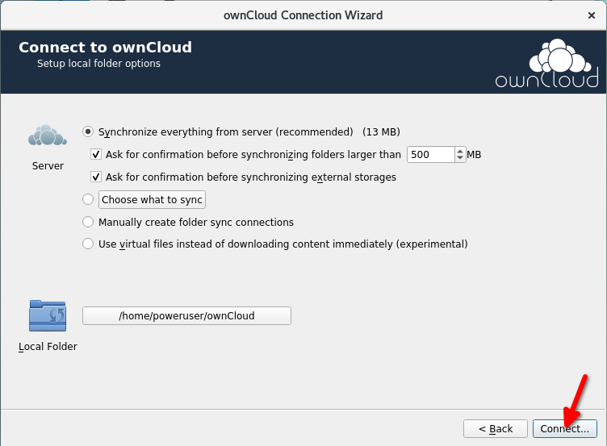
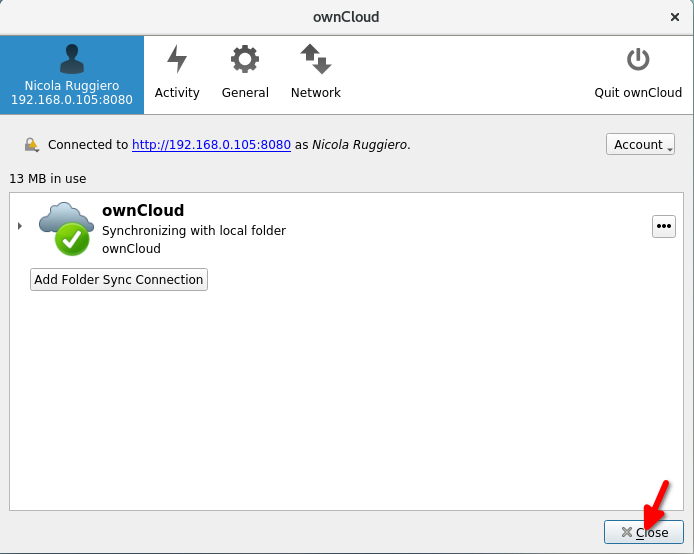
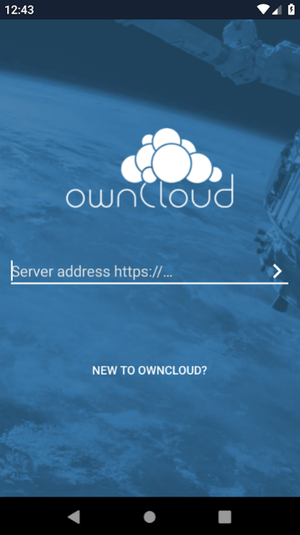
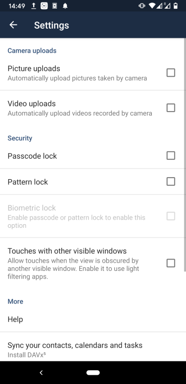

<!-- 4. As a user, how do I connect to the Owncloud server using a desktop or mobile client? -->
# Connect to the Owncloud server using a desktop or mobile client
Users can access and synchronize their personal data stored within the ownCloud server via desktop clients and mobile apps.

## Dektop clients
Desktop clients are available for [Mac Os](https://owncloud.org/download/#owncloud-desktop-client-macos), [Windows](https://owncloud.org/download/#owncloud-desktop-client-windows) and [Linux](https://owncloud.org/download/#owncloud-desktop-client-linux)

1. Once you installed the client, you will be presented with the **onwCloud Connection Wizard**. Enter your server details and click **Next**:

2. Now type your **Username** and **Password** and press **Next**:

3. Customize your settings and click **Connect...**

4. As soon as the first synchronization task completes, you can close the active window.

## Mobile Apps
Mobile Apps are available for [iOS and Android](https://owncloud.org/download/#owncloud-mobile-apps).

1. Once installed, open the App and type your server address `http://owncloud_ip:8080`

2. Enter your login details and tap on **LOG IN**

3. Select **Settings** to choose your synchronization preferences:

